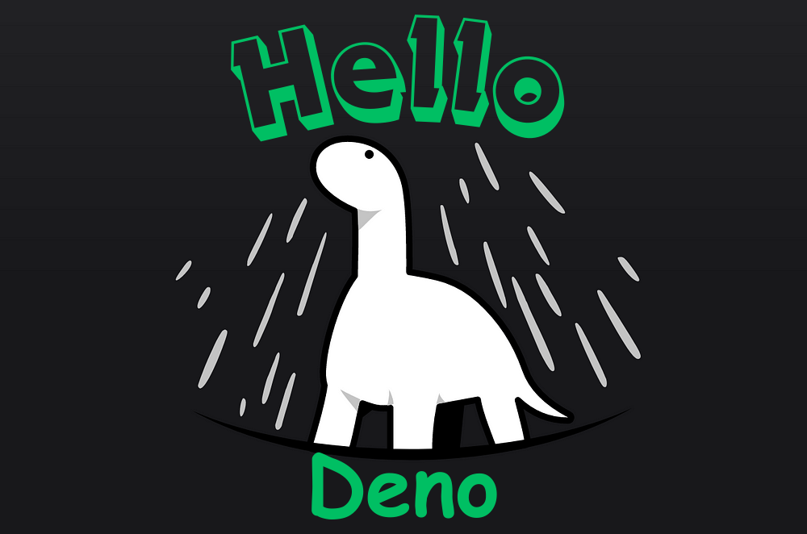

# Hello Deno! 🦕

  

<h3 align="center">Foreword</h3>

  A Deno dev container setup with some sandbox scripts to use on Visual Studio... Let's learn Deno!
   
  <a href="https://github.com/jgome284/hello-deno/issues">Report Bug</a>
  ·
  <a href="https://github.com/jgome284/hello-deno/issues">Request Feature</a>

 

## Table of Contents

- [Hello Deno! 🦕](#hello-deno-)
  - [Table of Contents](#table-of-contents)
  - [About Deno](#about-deno)
    - [History](#history)
    - [Features](#features)
  - [Setup](#setup)
  - [Prerequisites](#prerequisites)
    - [Docker](#docker)
    - [VSCode](#vscode)
  - [Getting Started](#getting-started)

## About Deno

### History

Deno is a modern JavaScript runtime spearheaded by Ryan Dahl, the creator of Node.js. In 2018, Ryan made a comeback when he gave a famous talk about his regrets on Node.js. His regrets motivated him to create a new runtime from scratch, and he ended the talk by announcing Deno, a modern runtime that addresses issues with Node.js including:

- **Promises:** The core Node.js code is mostly callback based. Some core modules have recently moved to promises.
- **Access:** A Node.js program can access everything that’s accessible by the user running it.
- **NPM:** NPM is a very popular package manager, but it is privately controlled.
- **Node_modules:** The module resolution is totally custom and complicated. No standards were followed.

### Features

Deno is a simple, modern, and secure runtime for JavaScript and TypeScript applications. It is built on the V8 JavaScript engine using Rust instead of C++. One of the main goals of Deno is to bring server-side JavaScript closer to browser JavaScript.

- **Secure by default:** Deno is secure by default. Unless enabled, there is no file, network, or environment access to the application. All the accesses need to be enabled explicitly. A Deno process doesn’t automatically inherit all the permissions that the running user has. All the accesses can be enabled globally or granularly. It is like running Deno in a container without having the overhead of a container runtime.
- **TypeScript out-of-the-box:** Deno has built-in support for Typescript through the TSC/SWC compiler. It’s important to note that, Typescript code needs to get converted to JavaScript code before it can run on the V8 engine as V8 still doesn’t understand Typescript. Conversion from Typescript to JavaScript happens at startup, unless there are dynamic imports.
- **Single executable:** Deno ships as a single executable. Although Deno is a single executable, it contains the entire development tool chain. The single executable includes: Core engine that runs TS/JS code, Tester, Upgrade manager, Debugger/Inspector, Formatter, Linter, Distributor, etc.
- **Third-party packages**: Deno doesn’t require/support any package manager to host third-party packages. All the third-party packages can be used as standard ES modules which gets imported through HTTP or could also be local. They can be hosted anywhere like GitHub, enterprise web server, personal web server, or local file system. Deno downloads them in a cache before using them.
- **Standard library:** Like all the major programming languages, Deno comes with a standard library that contains common peer-reviewed utilities like file, hash, HTTP, I/O, mime, WebSocket, log, date, time, UUID, crypto, hash, etc. Most of the standard library’s APIs are available through promises. There are hardly any old-style callbacks.
- **Web APIs:** Deno continually enhances its support for web APIs. Deno strives to have the same API as the browser. The familiar web APIs makes it easier for developers to write both front-end & server-side code. Some examples are- fetch, File, TextEncoder, TextDecoder, localStorage, sessionStorage, etc.

## Setup

This project includes a Dev Container for Visual Studio Code. It serves as a full-featured development environment with everything needed to develop with Deno. Dev Containers separate tools, libraries, or runtimes needed for working with a codebase. They aid in continuous integration and testing. Dev containers can be run locally or remotely, in a private or public cloud, in a variety of supporting tools and editors.

[This devcontainer](./.devcontainer/), is built IAW the [dev containers specification](https://containers.dev/implementors/spec/) and tailored for a build environment that leverages the official Denoland image for Deno on Debian Linux. Python is installed along with some libraries in accordance with [requirements.txt](./.devcontainer/requirements.txt). They are used to run the Deno kernal on jupyter notebooks. Additionally, the devcontainer has git for version control and several extensions installed for Visual Studio Code as development utilities.

## Prerequisites

### Docker

To start, you need to have Docker Engine and Docker Compose on your machine. You can either:

- Install Docker Desktop which includes both Docker Engine and Docker Compose
- Install Docker Engine and Docker Compose as standalone binaries

### VSCode

This devcontainer is setup for development on Visual Studio Code. You should have it installed along with the [remote development pack](https://marketplace.visualstudio.com/items?itemName=ms-vscode-remote.vscode-remote-extensionpack) to enable the IDE's devcontainers functionality.

There is an official extension for Visual Studio Code called vscode_deno. When installed, it will connect to the language server built into the Deno CLI.

Because most people work in mixed environments, the extension does not enable a workspace as Deno enabled by default, and it requires that the *"deno.enable"* flag to be set. (This is already handled in the [settings.json](/.vscode/settings.json) file). If you have your own settings, you can add the setting yourself, or run `Deno: Enable` from the command palette to enable your project.

## Getting Started

Open Docker Desktop to run the Docker daemon, a background process that manages and coordinates Docker containers on your system. On VS Code, start the development container by running `Dev Containers: Rebuild and Reopen In Container` in the command palette. It can be accessed with the keyboard shortcut `ctrl + shift + P` on your keyboard.

Visual Studio will establish a remote connection to the development container. Several extensions are installed in the IDE as development utilities. Of note, when a successful connection is made to the container, info for the version of Deno is displayed. Upgrading to the latest version of Deno is part of the build instructions on our [Dockerfile](\.devcontainer\Dockerfile). Of note, part of the reason for this development environment was to test the Deno jupyter kernal. As of January 2024, it is still unstable but there are plans to stabilize it in a future release. That means that you may have to remove the `--unstable` flag in the [Dockerfile](\.devcontainer\Dockerfile) build instructions. If your Dev Container build fails, you'll know why! 😁
